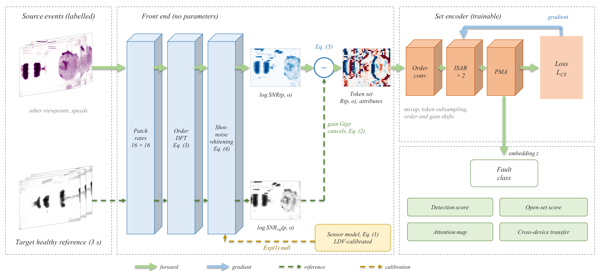

# REF-EvSet: Whitened Set Tokens for Reference-Only Event-Camera Fault Diagnosis

Code, result files and figures of the paper *"REF-EvSet: Whitened Set Tokens for Reference-Only Event-Camera Fault
Diagnosis"* (under review at *Mechanical Systems and Signal Processing*, 2026).

Event cameras sense machine vibration without contact, but published event-based diagnosis methods are evaluated with
labelled or fault-containing recordings of the target condition. In deployment, a camera mounted at a new viewpoint or
a machine running at a new speed provides only a short healthy recording made during commissioning. This repository
studies that **Reference-Only** protocol: the source domains are labelled, the target domain exposes only the first
3 s of its healthy recording, and every later window of the target domain must be classified. **REF-EvSet** turns the
event stream into per-patch order spectra, whitens them by their own shot noise, divides them by the healthy reference
of the same patch, and classifies the resulting tokens as a permutation-invariant set with a set-attention encoder.
The representation follows an event-sensor model that is calibrated against a laser Doppler vibrometer. All
experiments use the public XJTU-DV dataset (subsets Rotor, Pump and Beam).



## Results

Window accuracy, mean ± standard deviation over 3 seeds, copied from the tables of the paper
([results/expected_tables.md](results/expected_tables.md) holds Tables 1 to 8 with their notes).

**Rotor** (4 classes, 3 viewpoints, 2 speeds; Table 3). LOVO: new viewpoint, CS: new speed, LODO: new (viewpoint, speed)
cell. "+ ref." marks a re-implemented paradigm whose input is the reference-subtracted event representation.

| Method | Target data | LOVO | CS | LODO | Mean |
|---|---|---|---|---|---|
| EF-CNN + ref. | healthy reference | 0.611 ± 0.060 | 0.589 ± 0.032 | 0.688 ± 0.039 | 0.629 |
| EVS-T + ref. | healthy reference | 0.730 ± 0.035 | 0.717 ± 0.026 | 0.711 ± 0.026 | 0.719 |
| BiFovea-T + ref. | healthy reference | 0.712 ± 0.007 | 0.819 ± 0.017 | 0.770 ± 0.008 | 0.767 |
| SNN + ref. | healthy reference | 0.791 ± 0.006 | 0.782 ± 0.015 | 0.812 ± 0.007 | 0.795 |
| Linear (deployable baseline) | healthy reference | 0.702 | 0.745 | 0.688 | 0.712 |
| **REF-EvSet** | healthy reference | 0.786 ± 0.014 | 0.824 ± 0.029 | 0.797 ± 0.025 | **0.802** |
| Oracle (not deployable) | all target classes | 0.904 | 0.833 | 0.879 | 0.872 |

REF-EvSet has the highest mean over the three protocols among the deployable methods. On the single protocols the
strongest reference-subtracted competitors are slightly higher (SNN + ref. on LOVO and LODO, BiFovea-T + ref. on CS);
these differences are within one standard deviation of REF-EvSet. The raw event-frame CNN has the highest LODO value
of a deployable method (0.838): in LODO it sees every held-out viewpoint at the other speed, and it is at chance on LOVO
(0.348). The plain EF-CNN and Vox-CNN rows and FM-LR use 0.5 s windows; all other rows use 1 s windows. The raw (reference-free) versions of the prior
paradigms and the transductive test-time-adaptation variants are listed in Table 3 of
[results/expected_tables.md](results/expected_tables.md).

**Pump** (6 classes, 3 camera angles, 3 speeds, 2 settings; Table 4). HO-S: held-out speed, HO-AS: held-out
(angle, speed) cell.

| Method | HO-S | HO-AS |
|---|---|---|
| Linear, 1 s (deployable baseline) | 0.843 | 0.856 |
| EF-CNN + ref. | 0.999 ± 0.000 | 1.000 ± 0.000 |
| SNN + ref. | 0.948 ± 0.020 | 0.969 ± 0.002 |
| BiFovea-T + ref. | 0.970 ± 0.003 | 0.974 ± 0.003 |
| **REF-EvSet** | 0.988 ± 0.005 | 0.994 ± 0.003 |
| Oracle (not deployable) | 0.961 | 0.966 |

Pump is saturated once the healthy reference enters the input: the reference-subtracted event-frame CNN reaches
0.999 and 1.000 and is above REF-EvSet (0.988 and 0.994). With a held-out camera angle (HO-A) no method
exceeds 0.56 (REF-EvSet 0.510 ± 0.015, oracle 0.497; Table 4).

## Installation

Python 3.12 and a CUDA-capable PyTorch build are required for the cache builders and for training (the training
scripts use `cuda` and bfloat16 autocast). Verifying the shipped results needs only the CPU.

```bash
pip install -r requirements.txt     # install the PyTorch build that matches your CUDA version first if needed
```

The results were produced with Python 3.12, PyTorch 2.13 (CUDA 13.2), NumPy 2.4, SciPy 1.18, scikit-learn 1.9 and
Matplotlib 3.10 on one RTX 5090 (Windows 11, Git Bash).

## Quick start: verify the reported numbers without training

```bash
python scripts/verify_results.py
```

The script recomputes 125 reported numbers from the raw result files in `outputs/` and compares them with the values
of the paper; it ends with `125/125 checks pass` and exit code 0. The checks cover every LOVO / CS / LODO cell of
Table 3, the REF-EvSet row and the 1 s linear and oracle entries of Table 4, the Rotor ablations of Table 7, the
cross-device and Rotor zero-shot detection entries of Table 5 and the main Beam calibration quantities of Table 6
(Table 8 and the remaining entries are not part of the automatic check). The in-domain column of
Table 3 can be recomputed with `python scripts/collect_indomain.py`, and seed-aggregated accuracies of every run with
`python scripts/collect_results.py` and `python scripts/make_main_table.py`.

## Data preparation

XJTU-DV is public: X. Li et al., *XJTU-DV: Open-source dynamic vision dataset for non-contact vibration measurement and
fault diagnosis of mechanical systems*, Chinese Journal of Mechanical Engineering 39:100163, 2026,
<https://doi.org/10.1016/j.cjme.2025.100163>. Obtain the three archives from the dataset authors and place them in
the data root; stage 0 of `reproduce.sh` extracts them:

```
data/XJTU-DV/                 data root; override with the environment variable EVSET_DATA
  XJTU-DV-Rotor.zip           downloaded archives
  XJTU-DV-Pump.zip
  XJTU-DV-Beam.zip
  Rotor/   angle1_Healthy_1000.dat ...   (24 recordings, created by stage 0)
  Pump/    20HZ_H_15_-30.dat ...         (108 recordings)
  Beam/    Off_set1_trail1.dat ...       (30 recordings)
  Beam_LDV/ Off_set1_trail1.txt ...      (30 laser-vibrometer records; override with EVSET_LDV)
```

Details, file-name conventions and disk requirements are given in [docs/DATA.md](docs/DATA.md). The dataset and the
reader code of its authors are not redistributed here.

## Full reproduction

```bash
export EVSET_DATA=/path/to/XJTU-DV     # optional, default ./data/XJTU-DV
export PY=python                       # optional, interpreter used by all shell scripts
bash reproduce.sh                      # all stages; or: bash reproduce.sh <from> <to>, e.g. bash reproduce.sh 3 4
```

All GPU jobs run strictly one after the other. Stages are resumable (cache builders skip existing files).

| Stage | Content | Main scripts |
|---|---|---|
| 0 | extraction of the `.dat` and LDV files from the archives | inline |
| 1 | level-1 caches: patch counts at 100 µs (Rotor), 200 µs (Pump), 1 ms (Beam) | `evset/features/patch_rate.py`, `scripts/pump_survey_l1.py` |
| 2 | level-2 token caches (0.5 / 1 / 2 s Rotor, 0.5 / 1 s Pump, fixed-Hz Rotor) and dense frame / voxel caches | `scripts/build_l2_rotor.py`, `build_l2.py`, `build_frames_rotor.py`, `build_frames_pump.py` |
| 3 | linear baselines: deployable baseline, oracle and the frequency-map baseline | `scripts/linear_baselines.py`, `linear_v2.py`, `linear_freqmap.py` |
| 4 | Beam calibration of the sensor model, simulator validation, Fig. 6 | `scripts/beam_physics.py`, `beam_calibration.py`, `sim_validation.py`, `make_fig_physics.py` |
| 5 | REF-EvSet: configuration selection, 3 seeds on all protocols, Pump, add-ons, split-reference and open-set runs, checkpoints, dense CNN baselines | `scripts/train_evset.py`, `train_baseline_cnn.py` via `run_all.sh` |
| 6 | cross-device transfer, sub-patch tokens, no-reference ablations, Pump seeds, set-versus-grid and fixed-Hz ablations, cost table | `run_after.sh`, `run_after_b.sh`, `run_harden1.sh`, `run_harden2.sh` |
| 7 | summary tables, nested selection, open-set and conformal evaluation, Figs. 2, 4, 5, 7 to 10 | `scripts/collect_results.py`, `make_main_table.py`, `nested_selection.py`, `openset_eval.py`, `conformal_eval.py`, `make_fig_*.py` |
| 8 | same-protocol re-implementations of the prior paradigms, in-domain references, Pump baselines, Table 3 / Fig. 3, verification | `run_sota.sh`, `run_sota2.sh`, `run_sota3.sh`, `run_sota4.sh`, `run_sota5.sh`, `scripts/collect_indomain.py`, `make_fig_sota.py`, `verify_results.py` |

Approximate run time on one RTX 5090, from the time stamps of the original runs: a 30-epoch REF-EvSet run on Rotor
takes about 2 min (all tokens reside on the GPU); stage 5 takes about 8 h, stage 6 about 6 h and the GPU queues of
stage 8 about 3 h, i.e. about 17 h of training in total. The level-1 caches are built at about 2 s per
Rotor recording on the GPU; the Pump level-1 cache is built on the CPU. The caches occupy about 66 GB.

Notes on a reproduction from scratch:

- `run_sota3.sh` re-runs the EVS-T and SNN baselines with their final settings and overwrites the corresponding
  results of `run_sota.sh`; the numbers of the paper are those of `run_sota3.sh`.
- Retrained models can differ slightly from the shipped ones (GPU non-determinism, library versions);
  `verify_results.py` then lists the deviating checks.
- The trained checkpoints of the seed-0 LODO and LOVO models (`outputs/evset/ckpt_lodo_s0/*.pt`,
  `outputs/evset/ckpt_lovo_s0/*.pt`, 9 files, 31 MB) are part of the repository. They regenerate Figs. 9 and 10
  without retraining; phase E of `run_all.sh` retrains them.

## Protocols

Every recording is split in time: the first 3 s are the reference segment, a 0.5 s guard follows, and the remainder
is the evaluation segment (1 s windows, 0.25 s hop). A domain is a (viewpoint, speed) pair, extended by the operating
setting on Pump. Source domains contribute all windows with labels; the target domain contributes only the reference
segment of its healthy recording, and all evaluation windows of the target domain are test windows.

| Family | Rotor (`--kind`) | Pump (`--kind`, with `--subset pump`) |
|---|---|---|
| held-out viewpoint / camera angle | LOVO, 3 tasks (`lovo`) | HO-A, 3 tasks (`pump_lovo`) |
| held-out speed | CS, 2 tasks (`cs`) | HO-S, 3 tasks (`pump_cs`) |
| held-out (viewpoint, speed) cell | LODO, 6 tasks (`lodo`) | HO-AS, 9 tasks (`pump_lodo`) |

`--kind indomain` is the in-domain reference of the published methods (random 70/30 split of the evaluation windows
of every recording). Two brackets accompany every learned method: the deployable linear baseline (healthy-reference
standardisation) and the oracle (class-balanced standardisation with target-domain statistics, not deployable).

The reported REF-EvSet configuration is

```bash
python scripts/train_evset.py --kind lodo --seed 0 --l2 rotor_l2_w1 --win 1.0 --mixup 0.4 --no-rcn                    # Rotor
python scripts/train_evset.py --subset pump --l2 pump_l2_w1 --win 1.0 --kind pump_lodo --seed 0 --epochs 20 --mixup 0.4 --no-rcn   # Pump
```

Results are written to `outputs/evset/<tag>/<task>.json`.

## Re-implemented baselines

All baselines are trained on the same source windows and evaluated on the same target windows, with 3 seeds.
Results are written to `outputs/baselines/<tag>/<task>.json`; the queues are `run_all.sh`, `run_after_b.sh`,
`run_harden1.sh` (dense CNNs) and `run_sota*.sh` (all other paradigms).

| Name in the paper | Command |
|---|---|
| EF-CNN, EF-CNN + ref. (event-frame CNN) | `scripts/train_baseline_cnn.py --rep frames --norm raw\|ref --epochs 20` |
| Vox-CNN (voxel-grid CNN) | `scripts/train_baseline_cnn.py --rep voxel --norm raw --epochs 20` |
| EF-CNN + AdaBN-R, + AdaBN-T, + TENT | `scripts/train_sota.py --method tta` (one training, three test-time variants) |
| SNN, SNN + ref. (spiking CNN) | `scripts/train_sota.py --method snn --norm raw\|ref --snn_readout mem --snn_thr 0.5 --lr 3e-4` |
| Spec-CNN, Spec-CNN + ref. (global-rate spectrogram CNN) | `scripts/build_global_rate.py`, then `scripts/train_sota.py --method spec --norm raw\|ref` |
| BiFovea-T, BiFovea-T + ref. (bi-fovea event Transformer) | `scripts/train_sota.py --method evit --norm raw\|ref` |
| EVS-T, EVS-T + ref. (event voxel set Transformer) | `scripts/train_sota.py --method evstr --norm raw\|ref` |
| SSL-CS, strict / relaxed (self-supervised pre-training + cross-supervision) | `scripts/train_sota.py --method ssl --variant strict\|relaxed` |
| Linear, Oracle | `L2_NAME=rotor_l2_w1 L2_WIN=1.0 python scripts/linear_v2.py` (feature `snr_refratio`, normalisation `healthy-ref` / `oracle`) |
| FM-LR (per-pixel frequency map + logistic regression) | `scripts/linear_freqmap.py` |
| Pump: EF-CNN + ref., SNN + ref., BiFovea-T + ref. | `scripts/train_sota.py --subset pump --method cnn\|snn\|evit --norm ref --kind pump_lodo\|pump_cs\|pump_lovo` |

Add `--kind lovo|cs|lodo|indomain --seed 0|1|2` to the training commands. `train_baseline_cnn.py` reads the caches
`rotor_l2` / `rotor_frames` (0.5 s windows) by default, and `train_sota.py` reads `rotor_l2_w1` / `rotor_frames_w1`
(1 s windows).

## Figures

| Figure | File | Script | Inputs |
|---|---|---|---|
| 1 | `fig_framework` | `scripts/make_fig_framework.py` | Rotor caches; optional, see below |
| 2 | `fig_protocol` | `scripts/make_fig_protocol.py` | `cache/rotor_frames` |
| 3 | `fig_sota` | `scripts/make_fig_sota.py` | `outputs/` only |
| 4 | `fig_cells_lodo` | `scripts/make_fig_cells.py` | `outputs/` only |
| 5 | `fig_pump` | `scripts/make_fig_pump.py` | `outputs/` only |
| 6 | `fig_physics` | `scripts/make_fig_physics.py` | Beam level-1 cache, LDV files, `cache/rotor_l2` |
| 7 | `fig_whitening` | `scripts/make_fig_whitening.py` | `cache/rotor_l2`, `outputs/` |
| 8 | `fig_comb` | `scripts/build_class_snr_maps.py`, then `scripts/make_fig_comb.py` | `cache/rotor_l1`, `cache/rotor_l2` |
| 9 | `fig_tsne` | `scripts/make_fig_tsne.py` | checkpoints, `cache/rotor_l2_w1` |
| 10 | `fig_attention_lodo_angle3_2000` | `EVSET_DEVICE=cpu python scripts/make_fig_attention.py ckpt_lodo_s0 lodo_angle3_2000` | checkpoints, `cache/rotor_l2_w1` |

Figures 3, 4 and 5 can be regenerated from the shipped result files alone; the other figures need the caches of
stages 1 and 2. `scripts/make_fig_framework.py` draws Fig. 1 as native PowerPoint shapes with `python-pptx` and lets
Microsoft PowerPoint render the pdf and png through `pywin32`; it therefore needs Windows with PowerPoint installed
and is optional (`EVSET_FRAMEWORK_FIG=1 bash reproduce.sh 8 8`). The editable drawing is `figures/fig_framework.pptx`.

## Citation

The paper is under review. Until it is published, please cite it as

```bibtex
@unpublished{refevset2026,
  title  = {{REF-EvSet}: Whitened Set Tokens for Reference-Only Event-Camera Fault Diagnosis},
  author = {Author names to be added},
  note   = {Under review at Mechanical Systems and Signal Processing},
  year   = {2026}
}
```

## License

The code is released under the [MIT License](LICENSE). The XJTU-DV dataset is not part of this repository and remains
subject to the terms of its authors.

## Acknowledgement

We thank the authors of XJTU-DV for making the dataset public: X. Li, S. Yu, X. Chen, Y. Lei, B. Yang and N. Li,
*XJTU-DV: Open-source dynamic vision dataset for non-contact vibration measurement and fault diagnosis of mechanical
systems*, Chinese Journal of Mechanical Engineering 39:100163, 2026, <https://doi.org/10.1016/j.cjme.2025.100163>.
